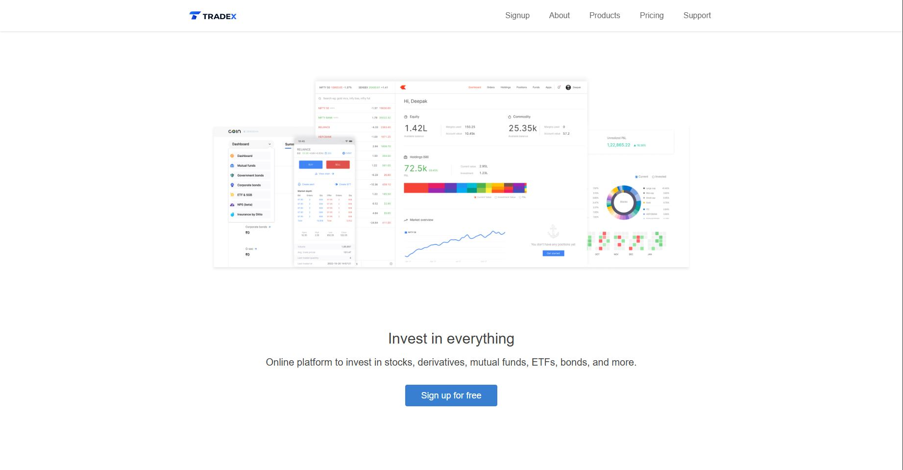
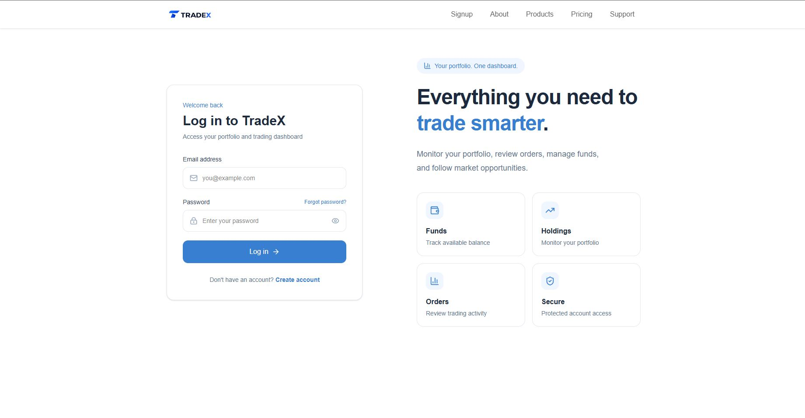
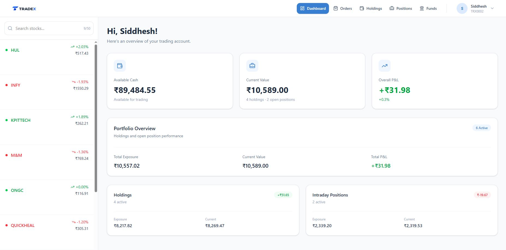
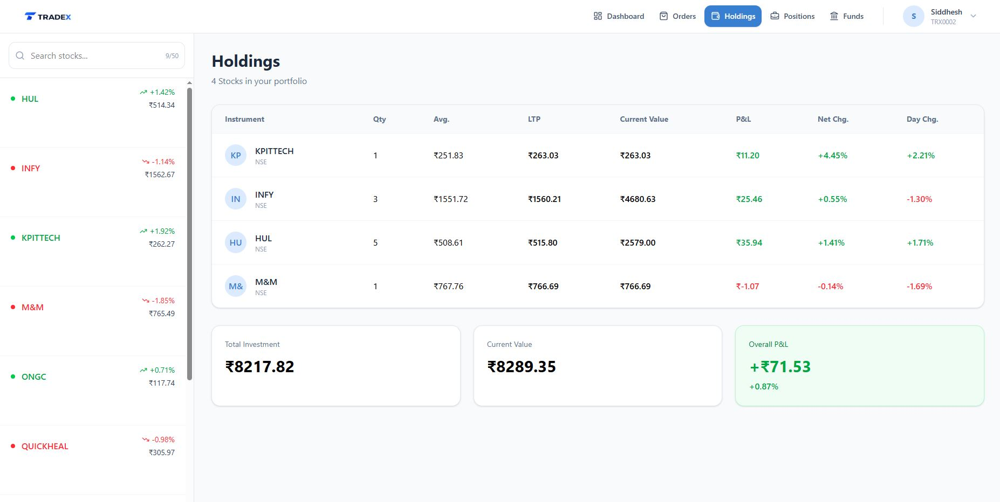
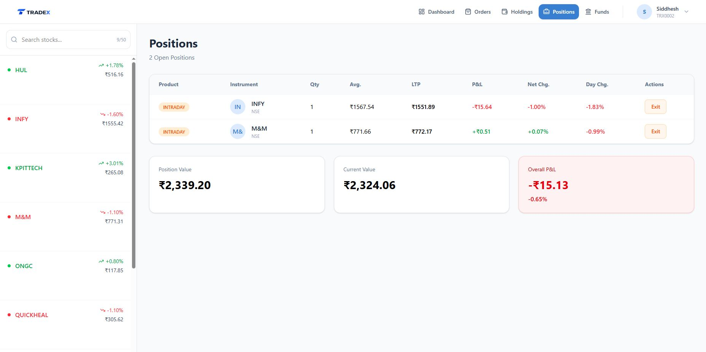
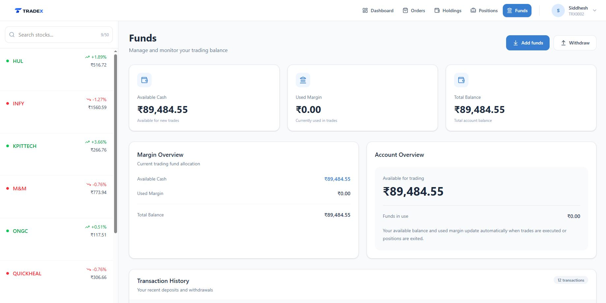

# TradeX

TradeX is a full-stack stock trading simulation platform inspired by modern brokerage applications.

The project includes a public landing website, secure user authentication, a trading dashboard, simulated live market prices, order execution, holdings and intraday position management, fund transactions, and portfolio analytics.

TradeX is built as a three-application architecture consisting of a landing frontend, trading dashboard, and backend API.

---

## Screenshots

### Landing Page



### Login



### Trading Dashboard



### Holdings



### Intraday Positions



### Funds Management



---

## Features

### Authentication

- User registration
- Secure password hashing using bcrypt
- Local authentication using Passport.js
- JWT-based authentication
- HTTP-only authentication cookies
- Protected dashboard routes
- Persistent authentication state
- Secure logout flow

### Trading Dashboard

- Account overview
- Available cash balance
- Portfolio current value
- Overall profit and loss
- Holdings and positions breakdown
- Portfolio exposure summary
- User profile information

### Simulated Stock Market

- In-memory simulated live stock prices
- Random market price movement
- Periodic market ticks
- Live price retrieval for order execution
- Market data initialized from PostgreSQL

### Orders

- Buy stock orders
- Sell stock orders
- Delivery and intraday products
- Order history
- Order status tracking
- Automatic portfolio updates after execution

### Holdings

- Delivery stock portfolio
- Quantity tracking
- Average purchase price
- Live market price
- Current portfolio value
- Profit and loss calculation
- Net and daily percentage movement

### Intraday Positions

- Open intraday positions
- Position quantity
- Average price
- Live market price
- Real-time profit and loss
- Position exit functionality

### Funds

- Add funds
- Withdraw available funds
- Available cash tracking
- Used margin tracking
- Fund transaction history
- Validation for insufficient balance

### Profile

- User information
- Client ID
- Account status
- Account creation date
- Available cash
- Used margin
- Trading account overview

---

## Tech Stack

### Landing Frontend

- React 19
- Vite
- React Router
- Tailwind CSS
- Axios
- Lucide React

### Trading Dashboard

- React 19
- Vite
- React Router
- Tailwind CSS
- Axios
- Sonner
- Lucide React

### Backend

- Node.js
- Express.js
- Prisma ORM
- PostgreSQL
- Passport.js
- JSON Web Token
- bcrypt
- Cookie Parser
- CORS

### Database

- PostgreSQL
- Prisma ORM
- Neon PostgreSQL

### Testing

- Vitest
- Supertest

### DevOps

- Docker
- Docker Compose
- Nginx
- Multi-stage Docker builds

---

## Project Architecture

```text
                         Browser
                            |
              +-------------+-------------+
              |                           |
              v                           v
     Landing Frontend              Trading Dashboard
        React + Vite                  React + Vite
        Nginx                         Nginx
              |                           |
              +-------------+-------------+
                            |
                            v
                       Backend API
                    Node.js + Express
                            |
                            v
                       Prisma ORM
                            |
                            v
                    Neon PostgreSQL
```

---

## Project Structure

```text
TradeX/
|
├── backend/
│   ├── config/
│   ├── controllers/
│   ├── middleware/
│   ├── prisma/
│   │   ├── migrations/
│   │   ├── schema.prisma
│   │   └── seed.js
│   ├── routes/
│   ├── services/
│   ├── tests/
│   ├── app.js
│   ├── index.js
│   ├── Dockerfile
│   └── package.json
|
├── dashboard/
│   ├── public/
│   ├── src/
│   │   ├── components/
│   │   ├── context/
│   │   ├── pages/
│   │   └── services/
│   ├── Dockerfile
│   ├── nginx.conf
│   └── package.json
|
├── frontend/
│   ├── public/
│   ├── src/
│   │   └── landing_page/
│   │       ├── about/
│   │       ├── home/
│   │       ├── pricing/
│   │       ├── products/
│   │       ├── signup/
│   │       └── support/
│   ├── Dockerfile
│   ├── nginx.conf
│   └── package.json
|
├── screenshots/
|
├── docker-compose.yml
└── README.md
```

---

## Environment Variables

Create environment files locally. Environment files are ignored by Git and should never be committed.

### Backend

Create:

```text
backend/.env
```

Example:

```env
DATABASE_URL=YOUR_POSTGRESQL_CONNECTION_STRING
JWT_SECRET=YOUR_SECURE_JWT_SECRET
PORT=3002
CLIENT_URLS=http://localhost:5173,http://localhost:5174
```

### Dashboard

Create:

```text
dashboard/.env
```

Example:

```env
VITE_API_URL=http://localhost:3002/api
VITE_LANDING_LOGIN_URL=http://localhost:5174/login
```

### Landing Frontend

Create:

```text
frontend/.env
```

Example:

```env
VITE_API_URL=http://localhost:3002/api
VITE_DASHBOARD_URL=http://localhost:5173
```

> Never commit database credentials, JWT secrets, passwords, or production environment variables.

---

## Local Development

### 1. Clone the repository

```bash
git clone YOUR_REPOSITORY_URL
cd TradeX
```

### 2. Install backend dependencies

```bash
cd backend
npm install
```

### 3. Generate Prisma Client

```bash
npx prisma generate
```

### 4. Apply database migrations

For development:

```bash
npx prisma migrate dev
```

For an existing production-style database:

```bash
npx prisma migrate deploy
```

### 5. Seed market data

If required:

```bash
npx prisma db seed
```

### 6. Start the backend

```bash
npm run dev
```

The backend runs on:

```text
http://localhost:3002
```

### 7. Start the dashboard

Open another terminal:

```bash
cd dashboard
npm install
npm run dev
```

The dashboard runs on:

```text
http://localhost:5173
```

### 8. Start the landing frontend

Open another terminal:

```bash
cd frontend
npm install
npm run dev
```

The landing application runs on:

```text
http://localhost:5174
```

---

## Running with Docker

TradeX includes Docker support for all three applications.

The frontend and dashboard are built using multi-stage Docker builds and served through Nginx. The backend runs in a Node.js container and connects to the configured PostgreSQL database.

### Build and start the complete application

From the project root:

```bash
docker compose up --build
```

The services are available at:

| Service           | Address                 |
| ----------------- | ----------------------- |
| Landing Frontend  | `http://127.0.0.1:5174` |
| Trading Dashboard | `http://127.0.0.1:5173` |
| Backend API       | `http://127.0.0.1:3002` |

### Stop the application

```bash
docker compose down
```

---

## Testing

Backend API and authentication middleware tests are implemented using Vitest and Supertest.

Run tests from the backend directory:

```bash
cd backend
npm test
```

Run tests in watch mode:

```bash
npm run test:watch
```

Current tests cover basic API availability and authentication middleware behavior.

---

## API Overview

### Authentication

```text
POST   /api/auth/signup
POST   /api/auth/login
GET    /api/auth/me
POST   /api/auth/logout
```

### Holdings

```text
GET    /api/holdings
```

### Positions

```text
GET    /api/positions
```

### Funds

```text
GET    /api/funds
POST   /api/funds/add
POST   /api/funds/withdraw
```

### Market

```text
GET    /api/market
```

### Dashboard

```text
GET    /api/dashboard/summary
```

Additional order execution routes are provided by the backend order service.

---

## Trading Flow

A typical TradeX user flow is:

```text
Sign Up
   |
   v
Login
   |
   v
Explore Market Watchlist
   |
   +------ Buy Delivery ------> Holdings
   |
   +------ Intraday Trade ----> Positions
                                  |
                                  v
                            Exit Position
   |
   v
Order History
   |
   v
Portfolio Summary
```

---

## Security Practices

The project uses:

- bcrypt password hashing
- JWT authentication
- HTTP-only cookies
- protected API middleware
- environment-based configuration
- CORS origin configuration
- ignored environment files
- server-side transaction validation

---

## Future Improvements

Potential future improvements include:

- WebSocket-based live market updates
- Candlestick and portfolio charts
- Limit and stop-loss orders
- Watchlist customization
- Advanced stock search
- Pagination for order history
- Email verification
- Password reset flow
- Rate limiting
- Expanded integration and service-layer testing
- CI/CD pipeline
- Cloud deployment

---

## Purpose

TradeX was developed as a full-stack portfolio project to demonstrate practical implementation of:

- full-stack application architecture
- React frontend development
- REST API development
- authentication and authorization
- relational database design
- Prisma ORM
- transactional trading logic
- portfolio calculations
- automated API testing
- Docker containerization
- multi-container orchestration
- production frontend serving with Nginx

---

## Author

**Siddhesh Gopal Sarang**

Full Stack Developer

---

## Disclaimer

TradeX is an educational stock trading simulation project. It does not execute real financial transactions or provide investment advice.
